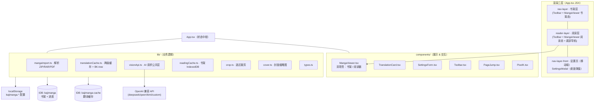
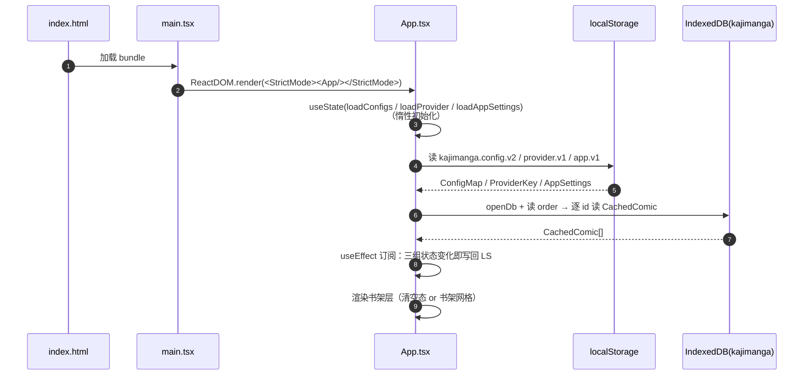
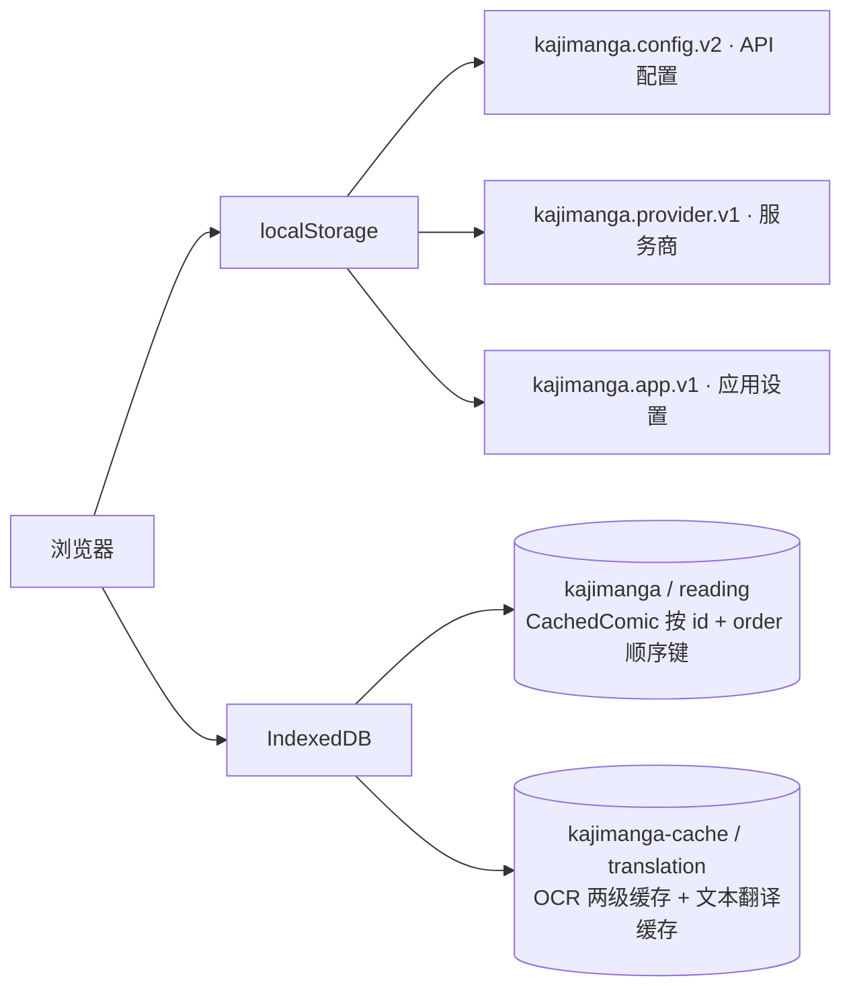
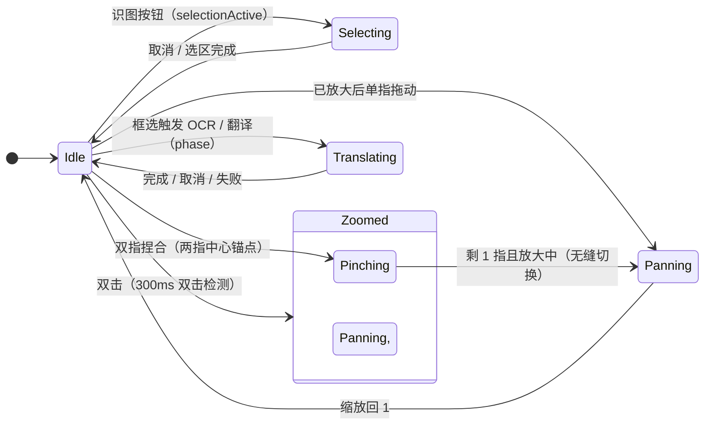
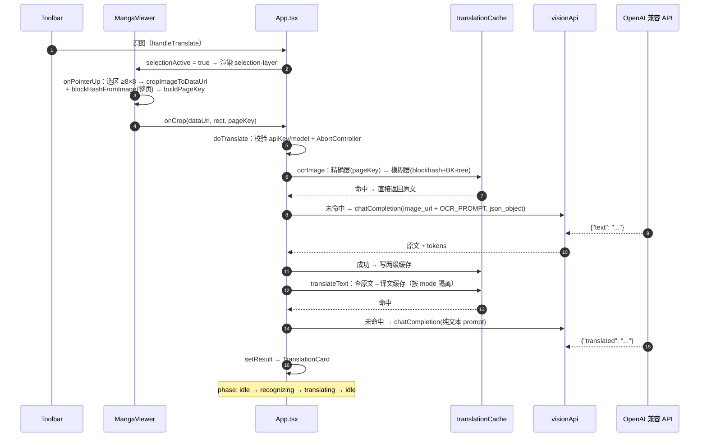
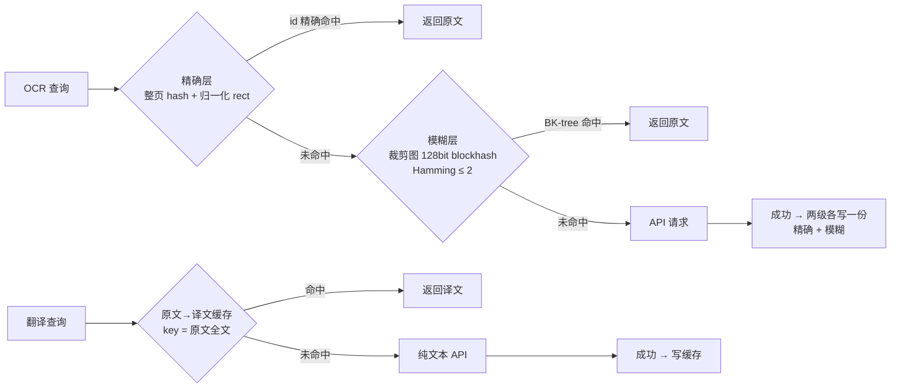
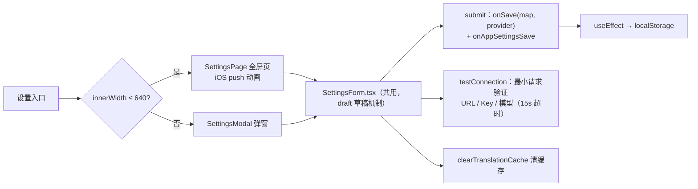
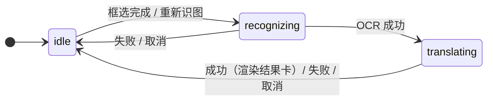

# Kajimanga — Architecture

> **Kajimanga** 是一个纯前端漫画翻译阅读器：本地解压 / 渲染漫画，书架与进度存 IndexedDB，框选页面区域后调用 OpenAI 兼容视觉模型完成日文识别与翻译。
>
> 本文档描述系统的**整体架构、启动流程、各功能调用链与关键机制**，阅读时可按文中路径对照源码。

| | |
|---|---|
| 架构 | 单页应用（SPA），无服务端，无框架级状态库 |
| 技术栈 | React 18（函数组件 + Hooks）、TypeScript、Vite 5 |
| 存储 | IndexedDB（书架 / 缓存）、localStorage（配置） |
| 外部依赖 | 4 个 OpenAI 兼容推理服务商（运行时由用户提供 Key） |

---

## Table of Contents

1. [Overview](#1-overview)
2. [Startup Sequence](#2-startup-sequence)
3. [Data Model & Storage](#3-data-model--storage)
4. [Module Breakdown](#4-module-breakdown)
5. [Import Pipeline](#5-import-pipeline)
6. [Reader Interactions](#6-reader-interactions)
7. [Two-Step Translation Pipeline](#7-two-step-translation-pipeline)
8. [Caching Strategy](#8-caching-strategy)
9. [Settings & Configuration](#9-settings--configuration)
10. [Error Handling & UI States](#10-error-handling--ui-states)
11. [Glossary](#11-glossary)
12. [References](#12-references)

---

## 1. Overview

应用为**三层渲染**结构：书架层（底）、阅读层（中，iOS 风格 push/pop）、设置页层（顶，仅移动端）。`App.tsx` 是唯一顶级组件，承担全部全局状态与业务编排，组件层只做交互与展示。



**核心设计点**

- **无服务端**：漫画文件、进度、缓存全部在浏览器内闭环；API Key 只存在于 localStorage。
- **MangaViewer 双职责**：无 `src` 时渲染书架，有 `src` 时渲染阅读器；阅读层挂载第二个实例。
- **两步翻译**：框选后先 OCR（发图）再翻译（纯文本），两步相互独立且各有缓存。
- **手势跟手**：缩放 / 平移期间直接写 DOM（`zoomRef`），松手一次性同步回 React state。

## 2. Startup Sequence



| 状态 | 初始化函数 | 存储键 | 说明 |
|---|---|---|---|
| `configs` | `loadConfigs()` | `kajimanga.config.v2` | 4 服务商 × (baseUrl/apiKey/model/thinking)，与默认值合并并校验 `thinking` |
| `provider` | `loadProvider()` | `kajimanga.provider.v1` | 当前服务商，默认 `qwen` |
| `appSettings` | `loadAppSettings()` | `kajimanga.app.v1` | 双击缩放 / 倍率 / 模式，与默认值合并 |

书架记录结构（`src/lib/readingCache.ts`）：

```ts
interface CachedComic {
  id: string          // crypto.randomUUID
  name: string
  data: ArrayBuffer   // 原始文件字节（书架不存页面图，省空间）
  pageIndex: number   // 阅读进度
  totalPages: number
  cover: string       // 封面缩略图 dataURL
}
```

## 3. Data Model & Storage



| 存储 | 键 | 值 | 生命周期 |
|---|---|---|---|
| localStorage | `kajimanga.config.v2` | `ConfigMap` | 设置保存时更新 |
| localStorage | `kajimanga.provider.v1` | `ProviderKey` | 同上 |
| localStorage | `kajimanga.app.v1` | `AppSettings` | 同上 |
| IDB `kajimanga` | `order` | id 数组（书架顺序） | 增删时更新 |
| IDB `kajimanga` | `comic.id` | `CachedComic` | 导入/续读/翻页时更新，删除时移除 |
| IDB `kajimanga-cache` | `params\|key` 或原文文本 | `CacheEntry` | 30 天 TTL，命中刷新 |

**缓存条目与隔离**（`buildParams`）：`JSON.stringify([provider, baseUrl, model, thinking, step, mode])` —— 更换服务商 / 模型 / 思考档位 / 模式后缓存互不可见。

## 4. Module Breakdown

| 模块 | 文件 | 职责 | 对外关键函数 |
|---|---|---|---|
| 入口 | `src/main.tsx` | 挂载根组件 | — |
| 状态中枢 | `src/App.tsx` | 全局状态、导入/续读/删除、两步翻译编排、设置持久化 | `handleImport`、`handleContinue`、`doTranslate`、`openReader` |
| 阅读器 | `src/components/MangaViewer.tsx` | 书架/阅读双职责、翻页动画、手势缩放、框选、坐标变换 | `crop→onCrop`、`toImageRect`、`toViewportRect` |
| 工具栏 | `src/components/Toolbar.tsx` | 返回/翻页/页码/识图/设置入口，phase 态按钮 | — |
| 译文卡 | `src/components/TranslationCard.tsx` | 展示原文/译文/学习解析/token，复制、重识图、重翻译 | — |
| 页码跳转 | `src/components/PageJump.tsx` | 点击数字变输入框，回车提交 | — |
| 设置表单 | `src/components/SettingsForm.tsx` | 桌面弹窗/移动页共用的设置表单（draft 机制） | `testConnection`、`clearTranslationCache` |
| 设置外壳 | `SettingsModal.tsx` / `SettingsPage.tsx` | 桌面弹窗 / 移动全屏页 | — |
| 品牌图标 | `src/components/PixelK.tsx` | 像素 K 图标（与构建脚本同字形） | — |
| 解析 | `src/lib/mangaImport.ts` | ZIP/CBZ、RAR/CBR、PDF → objectURL[] | `importManga`、`parseZip/Rar/Pdf` |
| 书架存储 | `src/lib/readingCache.ts` | IndexedDB 书架增删改查 | `loadShelf`、`saveComic`、`saveOrder`、`deleteComic` |
| 翻译缓存 | `src/lib/translationCache.ts` | 两级 OCR 缓存 + 文本缓存 + BK-tree | `get/setCachedOCRExact`、`get/setCachedSimilarOCR`、`buildPageKey` |
| AI 请求层 | `src/lib/visionApi.ts` | 服务商预设、Prompt、公共 `chatCompletion` | `ocrImage`、`translateText`、`testConnection` |
| 裁剪 | `src/lib/crop.ts` | 选区 → 原分辨率 JPEG dataURL（24px 网格对齐） | `cropImageToDataUrl` |
| 封面 | `src/lib/cover.ts` | 首页缩略图 | `generateCover` |
| 类型 | `src/lib/types.ts` | 共享类型与常量 | — |
| 构建 | `scripts/generate-icon.mjs` | 生成 PWA 图标（构建时执行） | — |

## 5. Import Pipeline

```mermaid
flowchart LR
    A[拖拽 / 文件选择] --> B{类型判定}
    B -->|zip / cbz| JSZ["JSZip → 过滤图片扩展名<br/>→ 数字感知排序 → blob URLs"]
    B -->|rar / cbr| RAR["node-unrar-js + WASM<br/>→ 过滤图片 → 排序 → blob URLs"]
    B -->|pdf| PDF["pdfjs-dist<br/>scale 2 渲染 canvas → JPEG"]
    B -->|纯图片| IMG["直接 openReader，不入书架"]
    JSZ & RAR & PDF --> C[urls: string[]]
    C --> D["handleImport: arrayBuffer + generateCover 首页缩略图"]
    D --> E["saveComic + saveOrder → IndexedDB"]
    E --> F["openReader(urls, comic.id, 0) 进入阅读"]
    D -.失败.-> G["toast-error 提示"]
```

- **排序**：`naturalCompare`（`localeCompare` 数字感知），保证 `page10` 排在 `page2` 之后。
- **封面**：`generateCover` 最长边 ≤ 220px，JPEG 0.8。
- **返回书架再读**：`handleContinue` 用存档字节 `new File([comic.data], name)` 重新走 `importManga`，`pageIndex` clamp 后恢复进度。

## 6. Reader Interactions

### 6.1 打开 / 返回

```text
openReader: setPages + setReaderNonce(resetToken) + 双 rAF → setReaderIn(true)
            → className 'reader-layer-open' 触发 push 动画
返回:       setReaderIn(false) → onTransitionEnd(transform) → revokeObjectURL 全部页面 + 卸载
```

> **双 rAF**：先渲染「静止态」一帧，下一帧再挂「目标态」类名，CSS transition 才生效。应用内所有层动画均用此技巧。

### 6.2 翻页

| 路径 | 组件 | 收敛 |
|---|---|---|
| 顶栏左右按钮 | Toolbar | `setPageIndex` |
| 底部导航 | nav-bottom（移动端） | `setPageIndex` |
| 左右热区 | hotzone buttons | `setPageIndex` |
| 页码跳转 | PageJump（回车提交） | `setPageIndex` |

动画：桌面（≥641px）直接切页；移动端「两帧法」——旧页记入 `turn`，新页先挂 `start` 类瞬移到屏幕外（借机解码），两帧后挂 `enter` 类滑入，`onTransitionEnd` / 600ms 兜底清理。翻页副作用：重置缩放 + 进度入库（`useEffect([pageIndex]) → saveComic`）。

### 6.3 手势状态机（缩放 / 平移）



- 缩放范围 clamp `[1, 4]`；平移边界 `maxX/Y = (图片尺寸×S − 舞台尺寸)/(2S)`，且位移 ÷S 抵消缩放坐标系影响，保证 1:1 跟手。
- 手势期间 `applyZoomLive` 直接写 `img.style.transform`；`onPointerUp` 把最后一次值一次性 `setZoom` 归还 React。
- 打开新漫画 / 翻页自动重置缩放；选区内平移拖拽不重置（保留缩放框选）。

### 6.4 坐标变换

框选与结果卡复用同一套变换，使用 stage/inner/img 的 `getBoundingClientRect()` 与当前 `zoom`：

```text
toImageRect(stage坐标)   → 布局坐标（裁剪用，缩放状态下所见即所得）
toViewportRect(布局坐标)  → 视口坐标（结果卡对准选区的视觉位置）
```

## 7. Two-Step Translation Pipeline



**取消**：`translateAbortRef.abort()` 与 30s 超时共用内部 AbortController；用户取消不弹错误（`signal.aborted` 分支）。

**结果卡操作**：

| 操作 | 调用 | 行为 |
|---|---|---|
| 复制原文 | `navigator.clipboard` → `execCommand` 降级 | 1.5s「已复制」反馈 |
| 重新识图并翻译 | `handleRetranslateFull` | 复用 `lastCropRef` 的 dataUrl/rect → `doTranslate(forceRefresh=true)`，两步跳过缓存 |
| 重新翻译 | `handleRetranslateText` | 仅用 `lastCropRef.text` → `translateText(forceRefresh=true)`，不重发图 |
| 关闭 | 退场动画 → `animationend` → `onDismiss` | — |

## 8. Caching Strategy



- **精确层**：`pageKey = 整页128bit hash + 归一化 rect(1%)`，同页同区域零误判；整页 hash 在 MangaViewer 内按 `src` 记忆（`pageHashCacheRef`）。
- **模糊层**：裁剪图 blockhash（blockhash.io 算法），内存 BK-tree 按 `params` 分桶，写入增量、首次查询懒构建，替代全表线性扫描。
- **24px 网格对齐**（`crop.ts`）：相近选区裁出完全一致的图，大幅提升哈希命中。
- **写缓存时机**：OCR / 翻译**成功才写**，失败或取消不写；`forceRefresh` 跳过读。
- **容量**：TTL 30 天、命中刷新；设置页提供「清空翻译缓存」(`clearTranslationCache` 清空整个 store)。

## 9. Settings & Configuration



**思考档位**（`thinkingParams`，按服务商差异传参）：

| 服务商 | 档位 | 关闭思考时的传参 |
|---|---|---|
| DeepSeek | off / low / high / max | `thinking:{type:'disabled'}`（显式关闭，防默认思考） |
| Qwen | off / on | `enable_thinking:false` |
| Kimi | off / on | 不传（默认不思考） |
| 自定义 | off / low / medium / high | 不传 |

## 10. Error Handling & UI States

**翻译状态机**（`phase: TransPhase`）：



| 错误 / 状态 | 载体 | 行为 |
|---|---|---|
| 导入失败 | `toast-error` | 书架层顶部提示 |
| 翻译错误 | `trans-error` 卡片 | 入场动画 + 5s 自动关闭（退场动画后卸载） |
| 未填 API 配置 | 同上 | `doTranslate` 前置校验，不发请求 |
| 请求超时 / HTTP 错误 | 同上 | 30s 超时「请求超时」；`!res.ok` → 自动去掉 `json_object` 重试一次 |
| 进行中 | `translating-card` | 「识别中…/翻译中… + 取消」按钮 |

**AI 响应容错**：`extractJson` 剥代码块 + 提取 `{...}` 子串；`fieldToString` 把任意 JSON 值（对象/数组/字符串）安全转可读文本；历史坏缓存（`[object Object]`）检测后强制重翻。

## 11. Glossary

| 术语 | 含义 |
|---|---|
| `phase` / `TransPhase` | 两步翻译流程状态：`idle / recognizing / translating` |
| `pageKey` | OCR 精确层缓存键：整页 blockhash + 归一化选区坐标 |
| `blockhash` | 128-bit 感知哈希（blockhash.io 算法），用于图片相似匹配 |
| `BK-tree` | Hamming 距离最近邻检索树，模糊层缓存索引 |
| `params` | 缓存隔离维度：`[provider, baseUrl, model, thinking, step, mode]` |
| `resetToken` / `readerNonce` | 每次打开新漫画递增，通知 MangaViewer 重置临时状态 |
| `zoomRef` | 手势实时缩放的 ref，与 React state 保持同步 |
| `objectURL` | 导入解压后页面的内存 URL，返回书架时统一 `revokeObjectURL` |
| 双 rAF | `requestAnimationFrame` 嵌套两帧，确保 CSS transition 生效 |

## 12. References

| 内容 | 位置 |
|---|---|
| 需求 / 功能 / 使用说明 | [`README.md`](./README.md) |
| 全部源码结构 | [`src/`](./src) |
| 样式与动画类 | [`src/styles.css`](./src/styles.css) |
| 构建脚本 | [`scripts/generate-icon.mjs`](./scripts/generate-icon.mjs) |